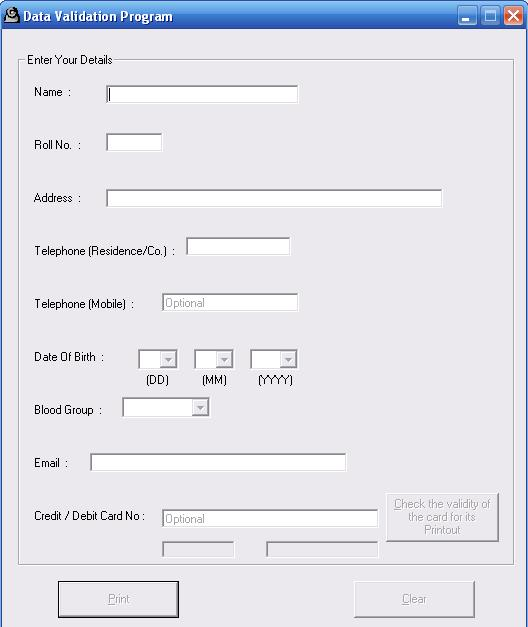



## Data Validation for a consistent database

### Description

The main objective of this program is to input valid data from the user. This program dosent allow the user to input invalid data. This is mainly required when working with databases. Cause if we catch errors at frontend, then we can handle it more appropriately. Also the database remains consistent.

Oohhh, one more thing ... Please Vote
 
### More Info
 

             |
---                |---
**Submitted On**   |2006-08-23 19:07:54
**By**             |[sherputtar](https://github.com/Planet-Source-Code/PSCIndex/blob/master/ByAuthor/sherputtar.md)
**Level**          |Beginner
**User Rating**    |4.7 (14 globes from 3 users)
**Compatibility**  |VB 4\.0 \(32\-bit\), VB 5\.0, VB 6\.0
**Category**       |[Miscellaneous](https://github.com/Planet-Source-Code/PSCIndex/blob/master/ByCategory/miscellaneous__1-1.md)
**World**          |[Visual Basic](https://github.com/Planet-Source-Code/PSCIndex/blob/master/ByWorld/visual-basic.md)
**Archive File**   |[Data\_Valid2028851142006\.zip](https://github.com/Planet-Source-Code/sherputtar-data-validation-for-a-consistent-database__1-66995/archive/master.zip)

